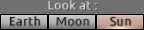
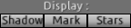

What can you do in Astrini?
===========================

  

    
  

  
You can first choose where to go to.

At option, Earth, Moon, Sun or Ext (for exterior, i.e. outside of system).

Look
====

  

    
  

  
Then you can determine what to look at.

Speed adjustment
================

  

    
  

  
Set the pace (+ or even ++) at which the celestial bodies rotate and spin.

 The **-1** key runs time backwards. You can **Pause** or take the configuration back to the present (**Now**).
 
 

  

    
  

  
Travel in time.

Jump forward in time, of one day, one month, one season or year.
 
Just below the keys for changing speed, the display keep tracks of (fictitious but realistic) time and date.

Factual changes
===============

  

    
  

  
The important keys in Astrini are those that change some parameters of celestial motions.

Astrini comes with an inbuilt wrong astronomy. In Astrini, the orbit of the Moon is not tilted relative to the plane of the orbit of the Earth, and the Earth's axis is not tilted relative to the plane of the orbit of the Earth. But you can revert to the actual parameters by clicking on the keys **Moon** and **Earth**, and even exaggerate a bit the tilt of the Moon's orbit (**Moon+**), so as to make eclipses harder to occurr.

Astrini comes with an inbuilt modified scale, so that you can see all the actors in the same scene. Push **Scale** to scale realistically the whole system.

Display options
===============

  

    
  

  
Toggle display options.

Finally, Astrini lets you visualize **Shadows** cast by Earth and Moon, orbits and pointers (**Mark**) and fictitious **Stars** that enhance the feeling of motion.

Non blocking interactions
=========================

We present next some simple activities you can perform on Astrini. No matter what the activity you are involved in, you can always change wiewpoint, speed, and object you are looking at, by using any of the above keys.

